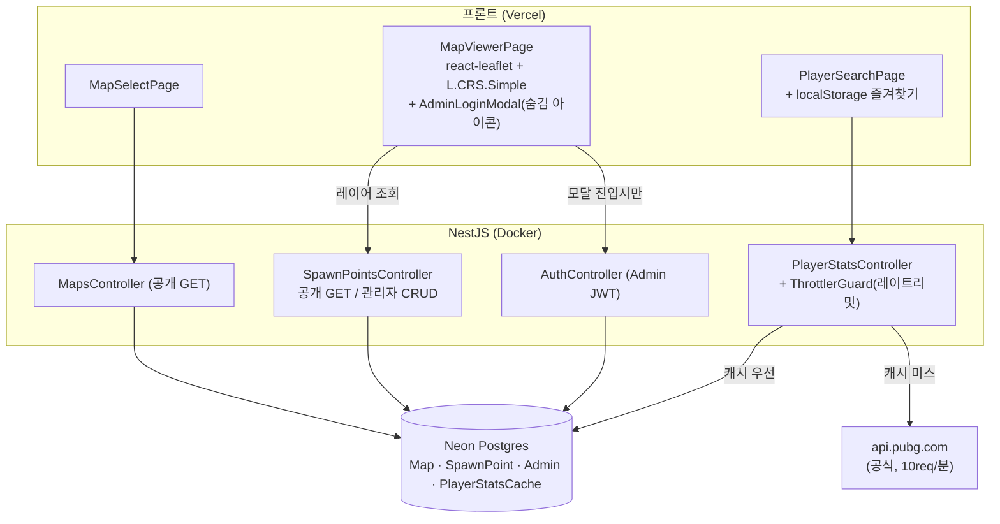

# RANGE CARD — ARCHITECTURE

> 이 문서의 중심은 두 가지다: **(1) 픽셀 좌표 ↔ Leaflet 좌표계 변환**과 **(2) 공식 PUBG API
> 레이트리밋(10req/분)을 캐시+스로틀로 방어하는 구조**. 나머지(NestJS 모듈 레이어링, Zustand/TanStack Query
> 역할 분리)는 표준 패턴을 따르며 특별할 게 없다.

---

## 1. 시스템 구성도

## 2. 픽셀 좌표 ↔ Leaflet 좌표계

지도는 게임 좌표가 아니라 **정사각형 이미지 자체가 좌표계**다. `L.CRS.Simple`(비지리 평면
좌표계)을 쓰면 게임맵 인터랙티브 뷰어에서 흔히 쓰는 검증된 패턴을 그대로 재사용할 수 있고
(직접 pan/zoom을 새로 짤 필요 없음), 이 CRS 아래 거리 계산이 하버사인이 아니라 유클리드
평면 거리라는 점이 박격포 계산기(고도 무시, 평면거리만)와 정확히 맞아떨어진다.

**컨벤션(고정)**:

- DB엔 이미지 좌상단 기준 원본 픽셀 좌표 `(x, y)` 저장 (범위 `[0, imageSizePx]`, 현재 모든 맵 `imageSizePx=2048`).
- `pixelToLatLng(x, y, imageSizePx) = L.latLng(imageSizePx - y, x)` — Leaflet의 lat은 위로
  증가하는데 이미지 y좌표는 아래로 증가하므로 **y축을 반전**해야 한다. 마커 렌더링에 사용.
- `latLngToPixel(latlng, imageSizePx) = { x: latlng.lng, y: imageSizePx - latlng.lat }` —
  지도 클릭 이벤트에서 받은 latlng을 다시 픽셀로 되돌릴 때 사용. 박격포 계산기의 두 클릭점,
  관리자 좌표 입력 폼이 이 함수 하나를 공유한다(`MapCanvas`의 `onPixelClick` 콜백 → 상위
  `mapUiStore.mode`에 따라 계산기/편집 중 어느 쪽으로 쓸지만 분기).
- 두 함수는 `frontend/src/lib/geo.ts`에 **Leaflet 비의존 순수함수**로 구현돼 있어 Leaflet
  없이도 라운드트립(`pixelToLatLng` → `latLngToPixel` → 원본과 오차범위 내 일치) 단위테스트가
  가능하다(`src/test/geo.test.ts`).
- `zoomSnap={0.25}`(기본 1 대신)로 설정해 `fitBounds`가 계산한 "꽉 채우는" 줌 레벨이 정수
  단위로 내림되어 이미지가 뷰포트 가운데 작게 뜨는 문제를 없앴다. 정사각형 맵을 가로로 넓은
  뷰포트에 넣으면 좌우 여백이 생기는 것 자체는 종횡비 유지를 위한 정상 동작이다.

## 3. PUBG API 레이트리밋 방어

공식 API는 개발용 키 기준 **분당 10회**로 제한된다. 이 예산을 지키기 위한 3중 방어:

1. **캐시 우선 조회** (`PlayerStatsCache`, TTL 10분) — 전적은 실시간성이 낮아 10분 캐시로도
   체감 지연이 없다. `(shard, playerName)`로 가장 최근 캐시를 찾고 TTL만 검사 — 시즌 ID는
   API 호출 전엔 알 수 없어서다.
2. **스로틀** (`@nestjs/throttler`, `/player-stats/search`만 분당 8회) — 공식 패키지 재사용,
   직접 구현 안 함. 여러 브라우저 탭이 동시에 몰려도 10회 예산을 넘기지 않는 안전장치.
3. **레이트리밋 시 stale 캐시 폴백** — 429가 나도 만료된 캐시가 있으면 완전 실패 대신
   `stale: true`로 표시해 반환한다(프론트가 "최신 데이터 아닐 수 있음" 안내에 사용). 폴백할
   캐시조차 없으면 그때는 503.

**에러 매핑 원칙**: 닉네임 없음 → 404, 레이트리밋+캐시없음 → 503, 그 외 연동 실패(키
미설정 등) → 503. 세 경우 다 "클라이언트 요청은 정상인데 우리 쪽 PUBG 연동이 지금 응답
못 한다"는 동일한 의미라 500(서버 버그로 오인되는 코드)을 쓰지 않는다.

DB엔 PUBG API 원본 JSON:API 응답을 그대로 저장하고(`PlayerStatsCache.payload`), HTTP
응답 시점에만 `player-stats.mapper.ts`가 `{ playerName, shard, seasonId, cachedAt, stale, modes[] }`
형태로 정규화한다 — 원본을 보존해야 API 스펙 변경이나 디버깅에 대응할 수 있어서다.

## 4. 인증 UX — 왜 전용 로그인 페이지가 없는가

이 프로젝트엔 일반 회원가입 유저 개념이 없다(맵 열람·전적검색 전부 공개, 즐겨찾기도
localStorage). 유일한 인증 대상은 "좌표 데이터를 유지보수하는 관리자"뿐이라, `/admin/login`
같은 전용 라우트를 두지 않고 `MapViewerPage` 구석의 작은 자물쇠 아이콘 → 모달로 로그인한다.
로그인 필드도 `email`이 아니라 `username`을 쓴다 — 이메일 기반 회원가입 자체가 없는
프로젝트라 CLAUDE.md의 "email==='admin' 리터럴 예외" 규칙을 억지로 끼워맞추지 않고, 그
규칙의 정신(좁은 예외·정상 bcrypt 인증·우회 엔드포인트 금지)만 유지했다. 데모 로그인
버튼도 `admin`/`admin`을 채워 넣고 정상 `POST /auth/login`을 그대로 호출한다.

## 5. 맵 이미지 출처

`frontend/public/maps/<slug>.webp` (2048×2048)는 `github.com/pubg/api-assets`
(KRAFTON 공식 GitHub, "Official Resources for PUBG API Developers")의
`{맵}_Main_High_Res.png`(8192×8192 원본, 지명 라벨 포함 버전)를 `cwebp -q 85 -resize 2048 2048`로
압축한 것이다. 같은 저장소에 라벨 없는 `_No_Text` 버전도 있으나, 지명이 있는 편이 실사용
가독성(어느 마을 근처인지 한눈에 파악)에 더 유리하다고 판단해 이쪽을 채택했다 — 부수적으로
공식 지명과 큐레이션한 좌표 라벨을 육안 대조 검증하는 데도 도움이 됐다. 좌표 데이터는 이
공식 이미지와 무관하게 별도로(커뮤니티 자료 교차검증) 큐레이션한다.

## 알려진 한계

- 좌표 데이터(`backend/data/*.spawn-points.json`)는 나무위키·커뮤니티 자료를 교차검증해
  큐레이션한 것이며 **전수조사가 아니다**. 신뢰 가능한 출처를 못 찾은 (맵, 레이어) 조합은
  추측으로 채우지 않고 비워뒀다(예: 론도의 고정 차량/비밀의 방/지하벙커, 미라마·태이고의
  지하벙커) — `LayerEmptyState`가 "아직 검증된 데이터 없음"으로 우아하게 처리한다.
- 박격포 유효 사거리(121~700m)는 공식 확정 수치가 아니라 커뮤니티 추정치다.
- 게임 패치·맵 리메이크로 좌표가 실제와 달라질 수 있다 — `SpawnPoint.isActive`/
  `lastVerifiedAt`이 이 드리프트에 대응하기 위한 필드다.
